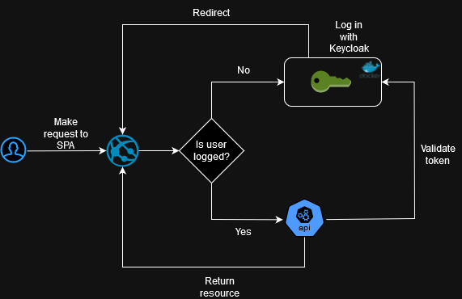
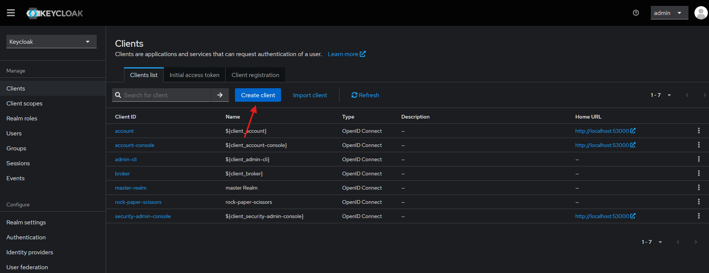

# Rock Paper Scissors

Basic rock paper scissors game made with Spring Boot and Angular

## Auth flow



## Start

Start the container containing Keycloak

```bash
docker compose up
```

Start Spring Boot server

Start Angular client

```bash
npm install
npm start
```

## Set up Keycloak

### Create client

Go to http://localhost:53000/admin and add the client. User and password is "admin"



Add http://localhost:4200 to the redirect URI and web origins


And you're ready to play!

| URL                                             | Description          |
| :---------------------------------------------- | :------------------- |
| `http://localhost:52000/actuator/httpexchanges` | Http exchanges       |
| `http://localhost:52000/actuator/logfile`       | Log file             |
| `http://localhost:53000/admin`                  | Keycloak admin panel |
| `http://localhost:4200`                         | Angular client       |
